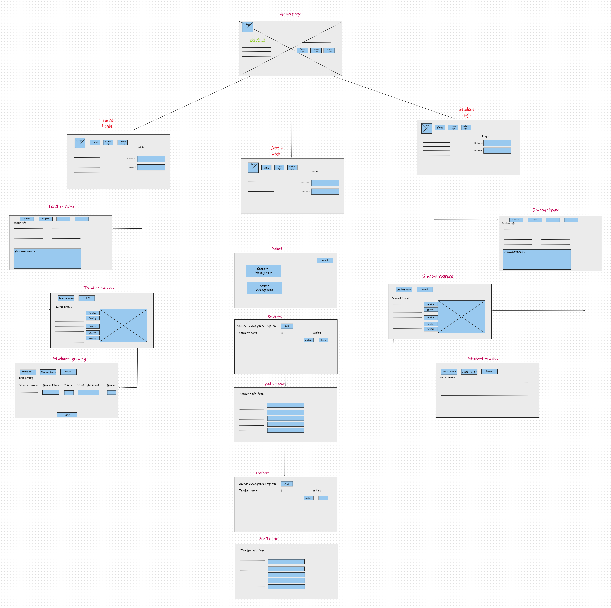

# Begin Wireframes & Software Requirements

## User Stories
- As a Student, I want login form so that I can easily `login` and `logout`.
- As an Admin, I want to get notify when a teacher is no longer in service' so that I can delete him right away.
- As a Teacher, I want to access to student info so that I can edit this info for student.
- As a Teacher, I want to access to student info so that I want to assign courses to students.
- As an Admin, I want to receive a notification when teacher is arrived so that I can add him up right away.
- As a Student, I want to see my latest update so that I can keep up and know were am I.

## The wireframe for this project

## Vision

>> Student management systems serve academic institutions in a variety of ways, the most important of which is centralized data administration and accessibility. Teachers will be able to input, maintain, and access student data more simply.

# Scope

* In the Software we can register as a User and User has three roles, students,teachers and administrator.
* Administrator has an ability to add new User and can edit and delete a User.
* Administrator can add, edit and delete all accounts.
* Administrator can add, edit and delete announcements. 

## Functional Requirements

#### 1- Users can sign in.
#### 2- Teachers can add new students.
#### 3- Admin can manage students and teachers accounts.
#### 4- Admin can register teacher and students.
#### 5- Teacher can assign courses for the students.

## Non-Functional Requirements
#### 1- The system should be able to authenticate Users.
#### 2- The system should be able to authorize Users.
#### 3- The system should be active on internet.
#### 4- The response time in the system must be fast.