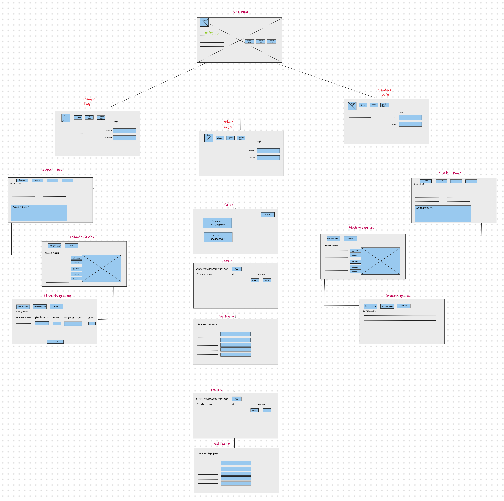

# School Registration System

## Groups Memembers Name
### 1- Mohammad Ghaenm.
### 2- Hashem Alsmadi.
### 3- Bashar Almhirat.

## About Project
#### In this project, we will create a web page represent school management system that manages a group of students, where students are added, modified, or deleted from the system by admins. and we will prepare a staff of teachers to teach these students.
#### In addition, we will create a registration section that will have access to the page, edit, delete and add students, and another section to view and answer student posts by teachers. And don't forget that we will be adding more and more new features.

## How to explore our project
### You can see The core of our project in this package [here](src/main/java/com/midproject/schoolregistrationsystem)
### The guide to understand our project by follow this tree template and so on.

                                       │───Example(package)
                                           │   Example.java(model)
                                           │   ExampleController.java
                                           │   ExampleService.java
                                           │   ExampleServiceImp.java
                                           │   ExampleRepository.java
                                    
 
## The wireframe for this project
