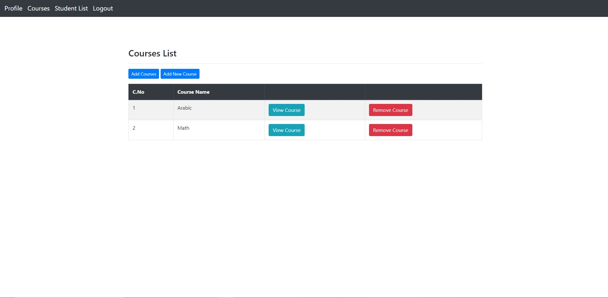

# School Registration System

## Groups Members Name
### 1- Mohammad Ghanem.
### 2- Hashem Alsmadi.
### 3- Bashar Almhirat.

### [Group agreement](ProjectReadMeFile/TeamAgreement/TeamAgreement.md)

### [Begin Wireframes & Software Requirements](ProjectReadMeFile/BeginWireframes&SoftwareRequirements.md)

## About Project
* In this project, we created A web page allows the admin(register) to manage a group of students, teachers, and other admins, where users are added, modified or deleted from the system. and we allowed teachers to add courses to the system and add/delete students to/from these courses.
* And the last thing is we make a section responsible to publish the Advertisement for different department in school and managed by admins.
* We Built this project with Java, Spring boot framework in backend and styled components for frontend Html, CSS, and Bootstrap with thymeleaf and PostgreSQL Database.

<h3 align="left">Languages and Tools:</h3>

      

## How to run our project
* You must have a postgresSQL.
* You must start postfresSQL in terminal using `pgstart`.
* Create database using `CREATE DATABASE 'DATABASE NAME'`.
* Go to `application.properties` in your project and update the database information you created.
* Run the project and go to [http://localhost:8080/](http://localhost:8080/).

# Screenshots of project

### Login page

---------

### Profile page

  

-------

### Users management page

------

### Add user form
  

-----

### Announcement management page

  

### Courses page
  

------

### Student list page(for Teacher)
  

------

### Add course to student page(by Teacher)
  

------

### Student courses page(for Student)
  

---------

### Tests
  
  

